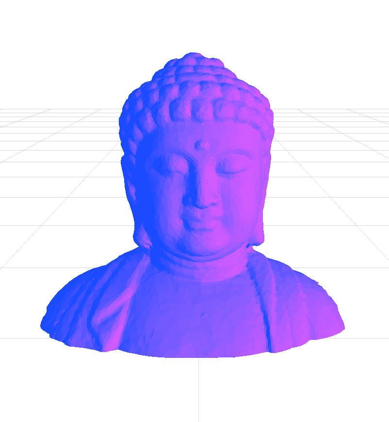

# Toon Shader Patch For Spark AR

Here's a Spark AR project file and patch to create a simple toon shader based on code found [HERE](https://www.lighthouse3d.com/tutorials/glsl-12-tutorial/toon-shader-version-ii/). Use this to create toon shader to make cool Instagram & Facebook filters!

Follow & support us on Instagram [@gowaaaofficial](https://www.instagram.com/gowaaaofficial/)

Find out more about us on www.gowaaa.com !

